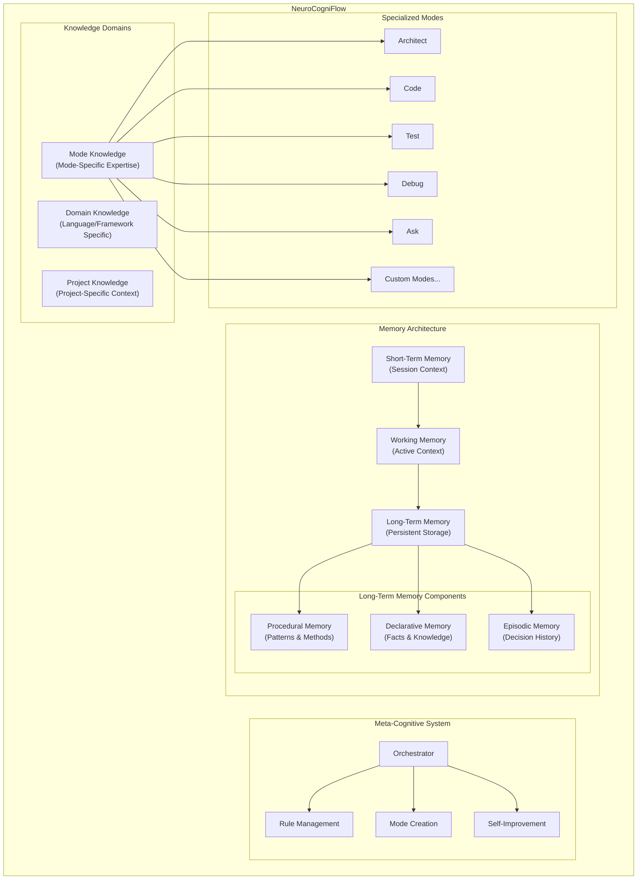

<div style="max-width: 800px; margin-left: auto; margin-right: auto; text-align: left;">

##### For those who wish to create other modes, I've added a [modules](https://github.com/GreatScottyMac/RooFlow/tree/main/modules) directory, containing the components of the RooFlow system prompts. Basically you would need to modify [modes.yml](https://github.com/GreatScottyMac/RooFlow/blob/main/modules/modes.yml) so that your new mode will interact correctly with the other modes. Then replace that section of [rooflow_core_prompt.yaml](https://github.com/GreatScottyMac/RooFlow/blob/main/modules/rooflow_core_prompt.yaml) and add the [memory_bank_strategy.yml](https://github.com/GreatScottyMac/RooFlow/blob/main/modules/memory_bank_strategy.yml) to the end of your `system-prompt-[mode]` file. You'll also need to add an entry to the [.roomodes](https://github.com/GreatScottyMac/RooFlow/blob/main/config/.roomodes) file. 

##### Now with install scripts for [Windows](https://raw.githubusercontent.com/GreatScottyMac/RooFlow/main/config/install_rooflow.cmd) and [Linux/macOS](https://raw.githubusercontent.com/GreatScottyMac/RooFlow/main/config/install_rooflow.sh)!

##### [Default Mode](https://github.com/GreatScottyMac/RooFlow#install-global-default-and-boomerang-modes) and [Boomerang Mode](https://github.com/GreatScottyMac/RooFlow#install-global-default-and-boomerang-modes) are available for manual installation.

##### For MCP server use in RooFlow custom modes, there is a `MCP_SERVERS_PLACEHOLDER` in the `system-prompt-[mode]` files where connected MCP servers will need to be inserted.
</div>

<div align="center">

<br>
  
### ☢️☢️☢️ Footgun in Use ☢️☢️☢️

<br>

# NeuroCogniFlow


**Cognitive-Inspired AI Development Framework with Multi-Layer Memory Architecture**

[](https://github.com/RooVetGit/Roo-Code)
[](https://github.com/GreatScottyMac/RooFlow)

</div>

## 🎯 Overview

NeuroCogniFlow is a cognitive-inspired framework for AI-assisted development that implements a multi-layered memory architecture modeled after human memory systems. It provides specialized modes with their own memory spaces, cross-domain knowledge sharing, and self-improvement capabilities, resulting in more contextually aware AI assistance across different projects and domains.

### Key Improvements:

* **Brain-Inspired Memory Architecture:** Implements short-term, working, and long-term memory systems with domain-specific and project-specific knowledge stores.
* **Mode-Specific Cognition:** Each specialized mode has its own memory space and perspective, enabling deeper domain expertise.
* **Adaptive Self-Improvement:** The system can modify its own rules, improve processes, and create new specialized modes as needed.
* **Multi-Project Context Management:** Maintains separate yet connected memory spaces for different projects, enabling cross-project learning.
* **Reduced Token Consumption:** Through targeted memory retrieval and context prioritization.
* **Seamless Knowledge Transfer:** Facilitates effective knowledge sharing between modes and across projects.

### System Architecture



## Memory Architecture

NeuroCogniFlow implements a cognitive-inspired memory system with multiple layers:

### 1. Short-Term Memory (STM)
- **Purpose**: Holds immediate session context
- **Characteristics**: Volatile, limited capacity, recent interactions
- **Implementation**: Current chat session state
- **Files**: None (in-session only)

### 2. Working Memory (WM)
- **Purpose**: Active manipulation of current context
- **Characteristics**: Limited capacity, actively processed information
- **Implementation**: `active-memory/` directory
- **Files**:
  - `current-focus.md`: Current task and context
  - `active-context.md`: Active project elements
  - `session-context.md`: Recent session history
  - `mode-specific/[mode]-context.md`: Mode-specific active context

### 3. Long-Term Memory (LTM)
- **Purpose**: Persistent knowledge storage
- **Implementation**: `memory-bank/` directory
- **Components**:
  
  #### 3.1. Declarative Memory
  - **Purpose**: Facts, concepts, explicit knowledge
  - **Files**:
    - `project-context.md`: Project overview, requirements, goals
    - `domain-knowledge/[domain].md`: Language/framework specific knowledge
    - `api-references.md`: External API information
  
  #### 3.2. Procedural Memory
  - **Purpose**: Patterns, methods, procedures
  - **Files**: 
    - `system-patterns.md`: Recurring patterns in the codebase
    - `workflows.md`: Common processes and workflows
    - `best-practices.md`: Best practices for this project
  
  #### 3.3. Episodic Memory
  - **Purpose**: History of events and decisions
  - **Files**:
    - `decision-log.md`: Important decisions and their context
    - `progress.md`: Project progress and milestones
    - `problem-solutions.md`: Problems encountered and their solutions

### 4. Mode-Specific Memory
- **Purpose**: Specialized knowledge for each mode
- **Implementation**: `memory-bank/modes/[mode-name]/`
- **Files**:
    - `expertise.md`: Mode-specific expertise and knowledge
    - `patterns.md`: Patterns relevant to this mode
    - `history.md`: History of this mode's activities

### 5. Project-Specific Memory
- **Purpose**: Separate memory spaces for different projects
- **Implementation**: Project root directory contains its own memory architecture
- **Cross-Project Learning**: Knowledge can be abstracted and shared across projects in `global-memory/`

## Self-Improvement Capabilities

NeuroCogniFlow can enhance its own capabilities through:

### 1. Rule Evolution
- Automatically updates its rule sets based on effectiveness
- Tracks rule performance and modifies underperforming rules
- Implements `rule-performance.md` to track rule effectiveness

### 2. Dynamic Mode Creation
- Can create new specialized modes as needed
- Analyzes patterns of work to identify needs for new specializations
- Implements `mode-creation.md` with templates and guidelines

### 3. Memory Optimization
- Analyzes memory usage patterns and optimizes storage structure
- Implements garbage collection for obsolete memory items
- Improves memory retrieval mechanisms over time

## 🚀 Quick Start

   ### Installation

   1.  **Install Roo Code Extension:** Ensure you have the [Roo Code extension](https://github.com/RooVetGit/Roo-Code) installed in VS Code.
   2.  **Prerequisite: Install Git:** The installation script requires `git` to be installed and accessible in your system's PATH. Download Git from [https://git-scm.com/downloads](https://git-scm.com/downloads).

   3.  **Open your terminal** and navigate (`cd`) to your project's **root directory**.
   4.  **Run the appropriate command** for your operating system directly:
       *   **Windows (Command Prompt or PowerShell):**
           1. Download the script:
              ```cmd
              curl -L -o install_neurocogniflow.cmd https://raw.githubusercontent.com/GreatScottyMac/RooFlow/main/config/install_rooflow.cmd
              ```
           2. Execute the downloaded script:
              ```cmd
              .\install_neurocogniflow.cmd
              ```
       *   **Linux / macOS (bash/zsh):**
           1. Download the script:
              ```bash
              curl -L -o install_neurocogniflow.sh https://raw.githubusercontent.com/GreatScottyMac/RooFlow/main/config/install_rooflow.sh
              ```
           2. Make the script executable:
              ```bash
              chmod +x install_neurocogniflow.sh
              ```
           3. Execute the downloaded script:
              ```bash
              ./install_neurocogniflow.sh
              ```
   5.  The command downloads and executes the script, which will create the cognitive memory architecture for your project.

   ### Using the System

   1. **Start a Chat:** Open a new Roo Code chat in your project.
   2. **Select a Mode:** Choose a specialized mode for your current task.
   3. **Memory Initialization:** If starting in a new project, the system will create a memory architecture.
   4. **Memory Commands:**
      - **"Update Memory" (UM):** Updates the memory with current session information
      - **"Create Mode" (CM):** Initiates the creation of a new specialized mode
      - **"Memory Status" (MS):** Shows the current state of the memory system
      - **"Cross-Project Knowledge" (CPK):** Access knowledge from other projects
   
   ### Memory Transfer Between Projects
   
   The system maintains a global memory space that abstracts knowledge from specific projects into reusable patterns and concepts. To share knowledge between projects:
   
   1. Use the "Abstract Knowledge" (AK) command to extract project-agnostic concepts
   2. When starting work on a new project, relevant knowledge will automatically be suggested

## Advanced Features

### Knowledge Abstraction and Generalization

NeuroCogniFlow can abstract specific knowledge into general principles and patterns, making them applicable across different projects. This is achieved through:

1. **Pattern Recognition**: Identifying recurring patterns in code, architecture, and problem-solving approaches
2. **Domain Separation**: Distinguishing between project-specific and domain-general knowledge
3. **Knowledge Generalization**: Converting specific implementations into general principles
4. **Cross-Project Application**: Suggesting relevant patterns from other projects when applicable

### Adaptive Memory Management

The system intelligently manages its memory to prioritize relevant information:

1. **Relevance Scoring**: Content is scored based on relevance to current context
2. **Memory Compression**: Less-used information is compressed to save token space
3. **Garbage Collection**: Obsolete or redundant information is archived
4. **Retrieval Optimization**: Memory retrieval is optimized based on usage patterns

### Collaborative Mode Orchestration

Specialized modes work together through:

1. **Task Decomposition**: Breaking complex tasks into mode-specific subtasks
2. **Knowledge Sharing**: Passing relevant context between modes
3. **Progress Tracking**: Maintaining a unified view of progress across mode switches
4. **Handoff Optimization**: Ensuring smooth transitions between modes

## Contributing

Contributions to NeuroCogniFlow are welcome! Please see the [CONTRIBUTING.md](https://github.com/GreatScottyMac/RooFlow/blob/main/CONTRIBUTING.md) file for guidelines.

## License
  [Apache 2.0](https://github.com/GreatScottyMac/RooFlow/blob/main/LICENSE>)
